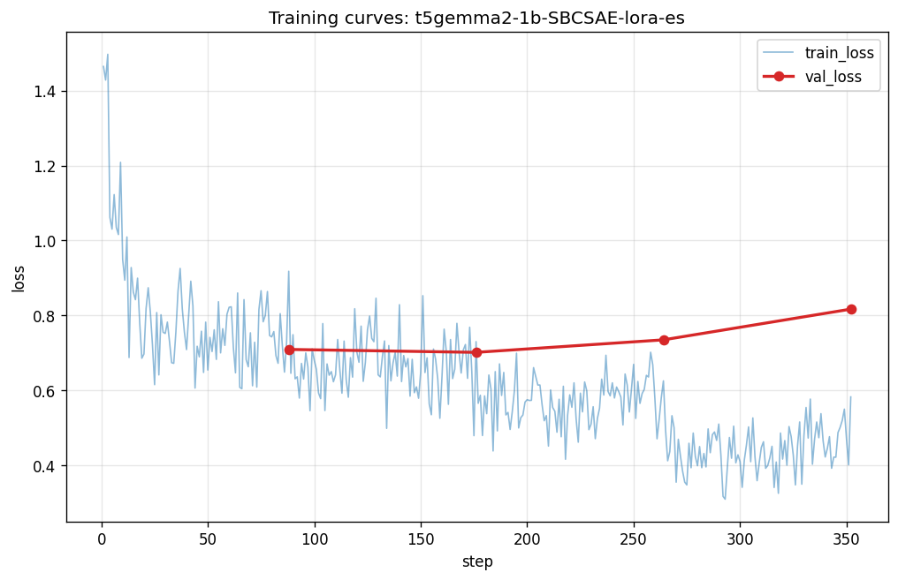

# 학습 결과 요약 — T5Gemma 2 1B casual 변환

본 문서는 보고서/발표용 집계 결과다. 개별 발화(SBCSAE 원문)는 라이선스(CC BY-ND
3.0 US)상 포함하지 않으며, 모두 분포 통계 수치다.

- base: `google/t5gemma-2-1b-1b` (encoder-decoder seq2seq)
- 방식: PEFT LoRA (r=16, bf16, all-linear), batch 1 × grad_accum 16, max_seq 1024, lr 2e-4, seed 42
- 데이터: SBCSAE, speaker-aware split (train/val/test = 1405 / 176 / 176)
- 평가: test split n=176

## 두 학습 설정 비교

| 항목 | 1-epoch (baseline) | early-stopped (epochs=8, patience=2) |
|---|---|---|
| run | `t5gemma2-1b-SBCSAE-lora-eos` | `t5gemma2-1b-SBCSAE-lora-es` |
| 실제 학습 | 1 epoch | epoch 4에서 조기종료, best=epoch 2 |
| train_loss | 0.795 | 0.622 |
| best eval_loss | — (eval 미실행) | 0.702 |
| train_runtime | ~2103s (~35min, RTX 4060 8GB) | ~8357s (~139min) |

## spoken-ness 메트릭 (예측 vs 참조)

task-specific 지표 — 참조보다 filler/pause가 **많으면 과적용, 적으면 미적용**.

| 지표 (mean) | 1-epoch | early-stopped | reference |
|---|---|---|---|
| length ratio (pred/ref) | 0.96 | 0.95 | — |
| tokens | 55.7 | 56.5 | 67.8 |
| fillers / item | 2.19 | 1.97 | 2.16 |
| pause:short / item | 3.02 | 2.31 | 3.48 |
| pause:long / item | 3.49 | 2.80 | 4.63 |
| lexical density | 0.428 | 0.428 | 0.427 |

## 해석 — eval_loss와 spoken-ness는 다른 신호

early-stopped 모델은 eval_loss가 더 낮지만(0.702), filler/pause는 reference보다
**적게** 나와 구어 마커를 약하게 적용한다. 반대로 1-epoch 모델은 filler가
reference에 거의 일치(2.19 vs 2.16)하고 pause도 더 가깝다.

→ **`eval_loss`(teacher-forced 확신도)와 출력 분포 정렬(spoken-ness)은 별개 신호**다.
낮은 loss가 reference 분포에 더 가까운 출력을 보장하지 않는다. 보고서에는 조기종료를
통한 학습 효율(불필요한 epoch 절감)을 보이되, 다운스트림 품질 기준에 따라 두
체크포인트 중 선택이 갈릴 수 있음을 함께 제시한다.

